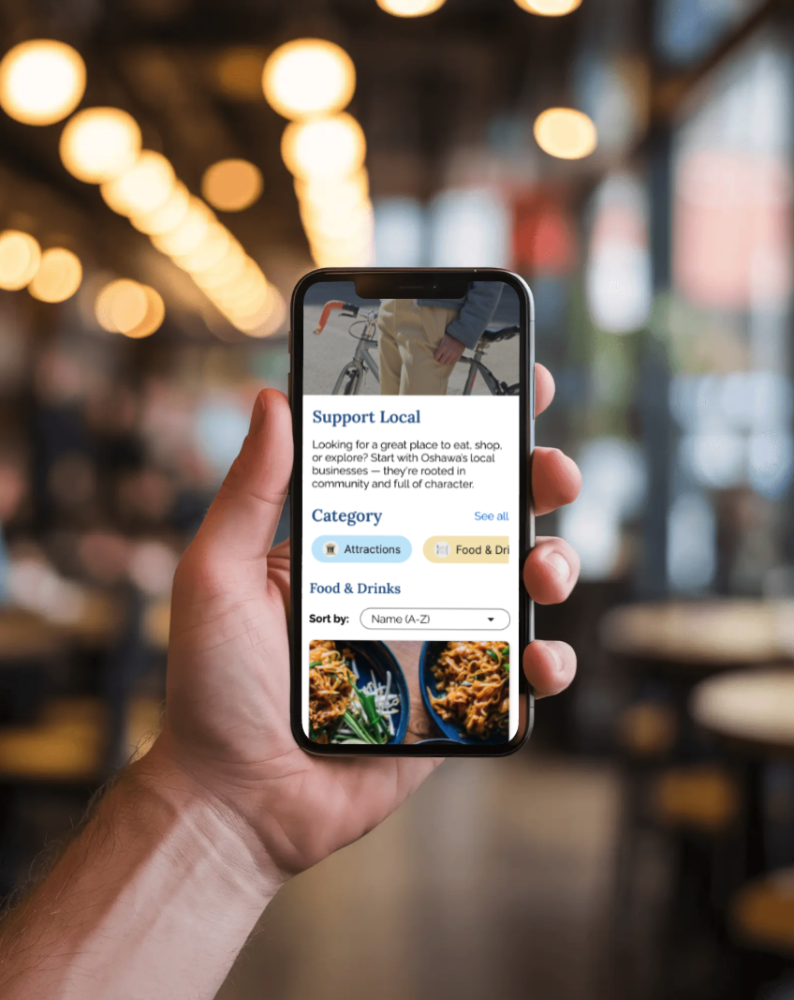

# Oshawa Connect

_This README is under construction and will be updated periodically._

## Features

- 🏘️ Connects residents with local events, services, and businesses in their area
- 📍 Displays business locations on an interactive map using markers (powered by Leaflet & React-Leaflet)
- 📐 Shows the distance from the user to each business based on geolocation
- 🔃 Sort businesses by name or distance (ascending or descending)
- 📱 Fully responsive design for mobile, tablet, and desktop
- 🚧 More features coming soon...

## Updates

    
🎃 October 2025

    <ul>
        <li>
            I've been MIA for the past month due do some other commitments. Also, I'll be overseas this month. My plan is to get back to this project once I return to Canada. ☺️
        </li>
    </ul>

    
☀️ August 2025

        

            
August 27, 2025

            <ul>
                <li>
                    I am back! I took a bit of a break after I finished studying about two weeks ago. If you're reading this, I want to remind you that it's okay to take a break and that your mental health and wellness are super important.
                </li>
                <li>
                    Updated the business data and Map component so that the key names match Leaflet's LatLngExpression.
                </li>
                <li>
                    Created Community Resources page. Added the page's section heading and description, as well as the category section component.
                </li>
                <li>
                    Changed the category section component to accept a prop for categories. Since this component will be on three different pages with unique categories, it was important for me to make sure the component reuseable.
                </li>
                <li>
                    Tomorrow I will focus on populating a list of data for community resources, and then hopefully finish the Community Resources page.
                </li>
            </ul>
        

        

            
August 2, 2025

            <ul>
                <li>
                    Used a mockup generator to showcase a glimpse of Oshawa Connect in mobile. Once I am done designing and building in mobile, I'll work on the other breakpoints. 🙂
                </li>
                <li>
                    Unfortunately I won't have the time to do much work on my project this weekend since I am studying for something important right now. Once I finish that, I will continue with this project.
                </li>
            </ul>
        

    
🌱 July 2025

        

            
July 29, 2025

                <ul>
                    <li>
                        Decided not to take a break today because I wanted to try using geolib after reading its documentation!
                    </li>
                    <li>
                        Replaced <code>latLon: [number, number]</code> in my static data file with <code>coordinates: {latitude: number, longitude: number}</code> for readability
                    </li>
                    <li>
                        Utilized geolib to calculate the distance between a user's coordinates and the businesses' coordinates, and then displaying this on the business card
                    </li>
                    <li>
                        Learned something new today: <code>toFixed()</code>, which rounds a number to a specified number of decimal places and returns a string. Keep in mind you'll need to convert it back to a number if you're doing math with it
                    </li>
                    <li>
                        Deleted <code>distance</code> property from the static date file <em>(it was just a placeholder as I worked on the UI)</em>
                    </li>
                    <li>
                        Added sorting feature. Can sort businesses by name and distance in ascending or descending order
                    </li>
                </ul>
        

        

            
July 28, 2025

            <ul>
                <li>
                    Integrated Geolocation API to grab a user's current location
                </li>
                <li>
                    Looked into using geolib to calculate the distance between a user's location + a business. Still going through the documentation!
                </li>
                <li>
                    Feeling really tired these last few days, so I will probably redirect my energy into learning Python and engaging in self-care activities. Will return to this project in a few days and hopefully implement a filtering feature 😅
                </li>
            </ul>
        

        

            
July 27, 2025

            <ul>
                <li>
                    Integrated a map using Leaflet and React-Leaflet! Oh goodness - open source is such a life saver! Thank you to the contributors. 🥹
                </li>
                <li>
                    Created business details page <em>(shows details related to individual businesses)</em>
                </li>
                <li>
                    Updated card component for conditional rendering based on the passed variant prop
                </li>
                <li>
                    Updated local businesses data with the location's lattitude and longitude values for map marker
                </li>
                <li>Began looking into the Geolocation API. Will need to read its documentation and also best practices re: access to user location data
                </li>
            </ul>
        

        

            
July 22, 2025

            <ul>
                <li>
                    Fixed a bug where I had duplicates of a business card
                </li>
                <li>
                    Created a pagination component and added functionality
                </li>
                <li>
                    Created a little util function to capitalize words
                </li>
                <li>
                    Polished high-fidelity mockups for the remaining pages: event details, business details, and community resource details
                </li>
                <li>
                    Added Figma wireframe preview link to README <em>(see below under Design & Tools for Technologies)</em>
                </li>
                <li>
                    Going to take a few days off from working on this project and continue with studying Python. I plan on getting back to this project on the weekend. I gotta balance studying as well! 😊
                </li>
        

        

            
July 20, 2025

            <ul>
                <li>
                    Added 27 local businesses to static data file... <em>I cannot wait until I integrate the database later</em> 🥲
                </li>
                <li>
                    Added a "recreation" category
                </li>
                <li>
                    Added filtering functionality to pills. Can click through the different categories of local businesses to display filtered businesses
                </li>
            </ul>
        

        

            
July 19, 2025

            <ul>
                <li> 
                    Began working on the Businesses page and populating a file with data
                </li>
                <li> 
                    Currently refactoring the Card component to make it more reuseable by utilizing conditional styling and rendering of card content
                </li>
                <li> 
                    Created a pill component to help users filter categories on pages
                </li>
                <li>
                    Added a utility function to format price level
                </li>
                <li>
                    Added a Post-MVP Enhancements section to the README
                </li>
            </ul>
        

        

            
July 18, 2025

            <ul>
                <li>
                    Added an "Updates" section to this README. Will be adding updates starting today
                </li>
                <li>
                    Created FAQs page with cards <em>(will need to style them more... they look too plain)</em>
                </li>
                <li> 
                    Created FAQs category page that will dynamically display a list of faqs based on the category name and slug
                </li>
                <li>
                    Created Contact Page and integrated Formspree. Tested and it works 🙃
                </li>
                <li>
                    Began developing Figma wireframes for local businesses/shops page
                </li>
        

## 🛠️ Technologies

### Frontend

- React
- Vite
- TypeScript
- SCSS/SASS
- Materiual UI (MUI)
- Motion
- Leaflet & React-Leaflet
- Geolocation API
- Geolib

### Backend

- Python
- Django

### Database

- PostgreSQL

### Design & Tools

- Figma - [view wireframes (WIP)](https://www.figma.com/design/5VLLBchXI1g9p3MSgtnsH7/oshawa-connect-wireframes-preview?node-id=0-1)

  **Note:** These wireframes reflect the current stage of the project and are works in progress. They are designed using a mobile-first approach and will continue to evolve as development progresses.

- Formspree

### Hosting

- <em>Most likely Vercel</em>

## API

More information later.

## Usage

More information later.

## Post-MVP Enhancements

- Switch from static data to dynamic database integration
- Add user-generated content and submission flow
- <em>More to be added as I continue to work through this project</em>
